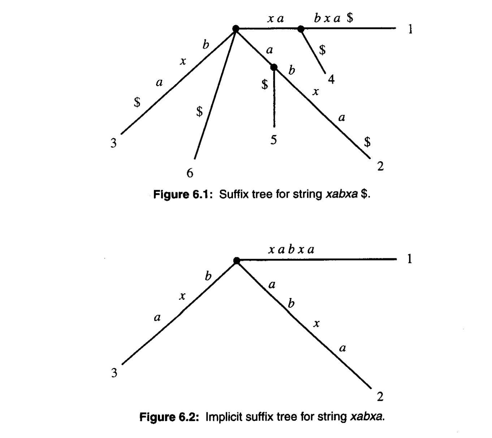

# 后缀树


## Ukkonen's 线性构造算法

对于一个字符串 $S$ 长度为 $m$, 我们用 $S(i)$ 表示第 $i$ 个字符. 
从 $1$ 开始编号. 我们用 $S[j..i]$ 表示一个字串从第 $j$ 个字符到第 $i$ 个字符. 所以说 $S[1..m]$ 表示整个字符 $S$. 

path-label 指从跟到 $v$ 节点经过的字符串

### 隐式后缀树 Implicit suffix tree

隐式后缀树是是一个后缀树

1. 删除所有 `$`
2. 删除所有无字符的边
3. 删除所有只有1个孩子的节点

我们用 $\mathcal{I}_i$ 表示 $S[1..i]$ 的隐式后缀树



### Ukkonen's 算法高阶描述

在第 $i+1$ 个阶段，我们从 $\mathcal{I}_i$ 构造出 $\mathcal{I}_{i+1}$

``` cpp
1. 构造 I1
2. For i from 1 to m-1 
    开始第i+1 个阶段 
    For j from 1 to i+1
        开始拓展j
        找到 S[j..i] 的路径最后一个节点
        如果需要的话，用字符 S(i+1) 来扩展新的节点, 来保证这个路径存在在这个树里面
``` 
### 扩展后缀 Suffix Extension

考虑第 $i+1$ 个阶段,
设 $S[j..i] = \beta$ 是一个 $S[1..i]$ 的后缀，在第 $j$ 个拓展，
当算法找到了$\beta$ 路径的最后一个字符，它拓展，使得 $\beta S(i+1)$ 在这个树里面。

#### Rule 1

$\beta$ 的路径在叶子节点结束，那么把 $S(i+1)$ 加入到这个叶子节点代表字符的后面。

#### Rule 2

$\beta$ 不是叶子节点，并且 $S(i+1)$ 不存在任何出路。那么必须建立一个新的，边为$S(i+1)$的叶子节点。如果 $\beta$ 在一条边内结束，那么也需要建立一个新的叶子节点。叶子节点标记为 $j$
        
#### Rule 3

$\beta$ 不是叶子节点，并且 $S(i+1)$ 已经存在于一条出边，那么我们什么都不要做

### Suffix Link

如果暴力实现上面的算法是 $O(m^3)$ 的，下面讲优化的方法。

#### Suffix Link
设 $x\alpha$ 是一个string, $x$ 是单个字符，$alpha$ 是一个字符串，可能为空. 对于一个内部节点 $v$，它的path-label是 $x\alpha$, 如果存在另一个点 $s(v)$, 它的path-label是 $\alpha$, 那么有一个从 $s$ 指向 $s(v)$ 的指针，叫做 suffix link

如果 $\alpha$ 是空的，那么suffix link 会指向根节点。
根节点不是内部节点，所以没有从它出发的suffix link.

事实上，每个内部节点都会有suffix link，接下来我们会证明一些定理

> Lemma 1

在第$i+1$个阶段的第 $j$ 次拓展，如果一个新的内部节点 $v$ 被建立了，它的 path-label 是 $x\alpha$, 那么要么path-label $\alpha$ 在一个内部节点结束，要么一个新的关于 $\alpha$ 尾部的内部节点会在下一次扩展被建立(第 $i+1$ 阶段的第$j+1$ 次扩展).

<details>
<summary> PROOF </summary>

只有 Rule 2 会建立新的节点，如果它不在内部节点结束，那么在下一次扩展将会需要再新建一个节点.
</details>

> Corollary 1

Ukkonen 算法中，一个新建立的内部节点将在下一次扩展结束时有一个suffix link. 

<details>
<summary> PROOF </summary>

所有 $\alpha$ 要么在下一次扩展被找到，要么在下一次扩展被建立新节点。这个时候会建立suffix link.
</details>


> Corollary 2

对于 $\mathcal{I}_i$, 如果内部节点$v$ 有 path-label $x\alpha$ 那么存在一个 $s(v)$, 它的path-label 是 $\alpha$.


### 用 Suffix Link 优化


考虑第 $i+1$ 个阶段,
我们寻找 $S[j..i]$ , 它是一个 $S[1..i]$ 的后缀，在第 $j$ 个拓展. 朴素算法是从根节点向下寻找，但是太慢了.

我们先考虑 $j=1,j=2$ 这两次拓展.

#### 第一次

我们寻找 $S[1..i]$, 它必须是$\mathcal{I}_i$ 的一个叶子节点. 这比较容易找到, 因为当我们构造树的时候，我们可以对每个叶子节点维护一个指针，这样我们就可以快速定位叶子节点了.

#### 第二次
我们设 $S[1..i]=x\alpha$, $x$ 是单个字符,$\alpha$ 是字符串. 我们设 $(v,1)$ 是一个进入叶子节点 $1$ 的边. (叶子1代表 $S[1..i]$)
接下来我们要寻找 $\alpha=S[2..i]$. 那么 $v$ 要么是根，要么是内部节点. 如果 $v$ 是根，那么我们就朴素的从根找 $\alpha$. 如果它是一个内部节点, 那么它就有一个suffix link. 那么我们就可以从 $s(v)$ 往下找. 

#### 第三次到最后

我们可以从上一次找到的地方, 至多向上移动一条边，然后通过suffix link找到下一个 $s(v)$ 然后往下找. 如果上一次结束的地方本身是一个叶子节点，那我们就不需要往上移动了，直接通过suffix link跳转就好了.

### 技巧 1: skip trick

我们在向下寻找的时候，只要根据首字母跳转即可. 不需要比较边上的每一个字符一一对应.

> Lemma 2

设 $(v,s(v))$ 是suffix link, 那么 $v$ 和 $s(v)$ 的深度至多相差1.

> 定理 1

Ukkonen 算法的每个阶段是线性的. 

<details>
<summary> PROOF </summary>

每个阶段最多 m 次拓展，每次拓展是向下走的, 用suffix link深度最多减少1, 而且深度最大是 $m$, 所以是线性的.
</details>

### 技巧 2: 边界压缩 Edge-label compression

用一个区间变量 $[l,r]$ 来表示边上的字符串，而不是真实的存下来这么多字符.

### 技巧 3: Rule 3

> Observation 1

Rule 3 是一个停止的信号. 如果使用了 Rule 3, 那么这个阶段就可以结束了.

> Observation 2

如果一个叶子节点被建立了，那么它永远都是一个叶子节点. 这意味着，如果一个叶子节点 $j$ 被建立了，那么后面的更新中, 这个叶子节点都会使用一次 Rule 1. 

所以, 设 $j_i$ 是第i个阶段最后一次扩展. 那么 $j_i \le j_{i+1}$. 因为叶子节点不会减少，所以Rule 1 的操作次数不会减少，那么最后一次操作肯定是 Rule 1 之后. 


### 技巧 4: 集体更新

如果一个叶子节点被建立了，那么我们用 $[l,e]$ 来表示这个边上的区间，其中 $e$ 是一个全局变量. 这样，我们就可以修改 $e$ 来进行拓展叶子节点的操作, 对于 Rule 1 操作.

这样 Ukkonen 算法就是 $O(m)$ 的了


